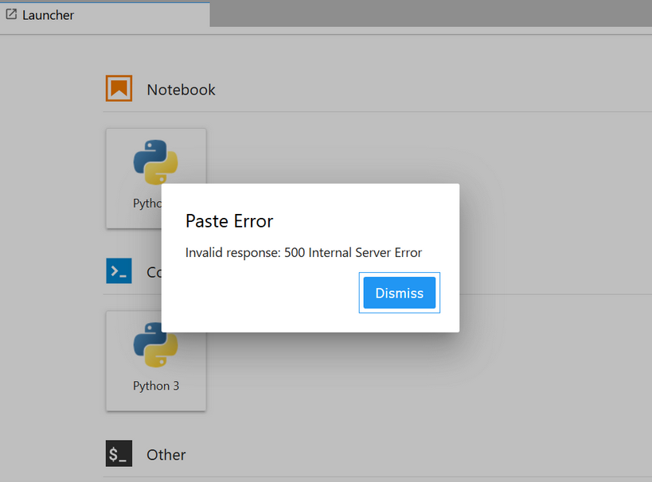

[](https://www.onda-dias.eu/cms/)

# Welcome to CLEOPE! 
**CLEOPE** (CLoud Earth Observation Processing Environment) is a DIAS-ONDA service of EO products discovery, manipulation and visualization via interactive Jupyter notebooks supported by Python 3 kernel language.

[](https://www.python.org/static/community_logos/python-logo.png) 
[](https://jupyter.org/assets/main-logo.svg)

CLEOPE consists in a collection of pre-installed libraries and template notebooks to enhance users experience with ONDA data offer. All the examples are available in a shared environment with the aim to help users to easily explore ONDA services main functionalities, to learn how to access data and the way to approach EO cloud resources through Advanced API (ENS). 
Example notebooks provided into CLEOPE are split into two main categories:
  - a set of templates aimed at facilitating the data access on Cloud;
  - a collection of mission specific tutorials, particularly suited for educational purposes, which will help users to process EO data offered by ONDA.

Technical details are provided 👉 [here](#tech).

# The Workspace
CLEOPE **public workspace** offers collection of template notebooks aimed at easly introducing users to browse, inspect and download products via the OData API protocol or using DIAS-ONDA Advanced API (ENS). 


### OData API provided interface
Via their own Jupyter notebooks users can easily download ONDA products, by specifying their ONDA `username` and `password` and the desired items. The download option is supported by the [OData API](https://www.onda-dias.eu/cms/knowledge-base/odata-odata-open-data-protocol/) protocol which allows browsing, selecting and downloading EO products via ONDA Catalogue. All the downloaded products are stored in the 📁`local_files` folder accessible within user own CLEOPE workspace, unzipped and ready to be used.

### Advanced API (ENS) provided interface
On the other hand the [Elastic Node Server (ENS)](https://www.onda-dias.eu/cms/knowledge-base/adapi-introduction/) software provides a simple and scalable front-end to the ONDA Data Storage on cloud which extends traditional Object Storages by exposing standard Directories and Files. Within CLEOPE a dedicated ENS access point exposing products in their native format is provided to users that want to directly access products and process them (i.e. _legacy mode_). 

## Default directory tree


### Shared resources
📁 `modules` folder collects the main libraries related to the set of template notebooks provided within CLEOPE workspace.
- Modules aimed at the **data access** are:
    - `aoi.py`, `buttons.py` and `empty.py`, which are specific scripts interfaced with the geographical research of products via Jupyter Notebook;
    - `qm.py` which is a module dedicated to the product **search**, **order** and **download** via Jupyter Notebooks. <br>
    
- Modules dedicated to **EO data processing** are mission-wise scripts called in the mission dedicated notebook.
    - `cams.py`, `cgls.py` and `cmems.py` are named after the mission they are dedicated to - Copernicus Atmosphere, Copernicus Land and Copernicus Marine, respectively;
    - `data_processing_*.py` are named after the Sentinel mission of reference.<br>

More information on the mission-dedicated notebooks is provided 👉[here](Trials/readme.md#mission).

📁`output` and 📁`resources` are folders sharing temporary data (i.e. logs) and sample inputs for the template notebooks set. <br>
📁`local_files` folder is the default destination folder of products downloaded via Jupyter Notebooks. <br>

#### Mission dedicated notebooks
📁🌎🌍🌏 are folders collecting mission specific notebooks, showing some type of processing for Sentinel missions and Copernicus Monitoring Services, using the modules of reference. <br>
Full explanation of mission specific trial notebooks is given 👉[here](Trials/readme.md#mission). 

# CLEOPE technical information
<a id="tech"></a>
CLEOPE is deployed as [The Littlest Jupyter Hub - TLJH](http://tljh.jupyter.org/en/latest/index.html) on OVH private cloud infrastructure provided with [ENS-legacy](https://www.onda-dias.eu/cms/knowledge-base/adapi-introduction/) interface, which allows users to directly access and process ONDA EO products.<br>
TLJH is configured with a **Python 3 kernel**, already provided with a set of additional Python packages aimed at EO data processing and visualisation with respect to any other default Jupyter environment.<br> Users can install any other Python package in their own CLEOPE environment via the `pip` channel in the way described 👉[here](#packages).

## CLEOPE limitations 
Registered users service are subject to the following hardware limitations:

| **Disk** |**RAM**|**CPU**|
| ------------- | ------ |-------------|
|20 GB|2 GB|2|

- **Disk limit** - when the threshold is exceeded an error message is print out on screen, by both
    - command line:<br>`cp:error writing 'file': Disk quota exceeded`
    - GUI: <br>

- **RAM limit** - for memory consuming assignments the RAM threshold may be exceeded so the exception<br>
    ````python
    MemoryError:
    ````
    is raised. In this case users have to restart kernel -<br> 
    🔄 Kernel Restart & ▶️ Run<br> being careful to run only tasks compliant to the quota limit imposed by CLEOPE configuration. Please note that shutdown unused notebooks is supplemental to helping with memory errors.

- **CPU property** specifies the total CPU cores that each user can use within CLEOPE workspace. The CPU limit repeatedly pauses demanding processes to avoid in exceeding quota, affecting performances of a single assignment in terms of clock-speed, accordingly.

👉 Please note that CLEOPE service can be upgraded to _premium_ upon monthly fee payment, where no quota limitations are imposed.

## Python 3 packages
### Installation
<a id="packages"></a>
Opening a new terminal, users can call 
```shell
pip list
```
shell command to list all the installed packages and corresponding versions.<br>
New packages can be easily installed running:
```shell
pip install <package_name>
```
or specifying the version:
```shell
pip install <package_name>==<version>
```
### Add modules to the local path
By default, Python looks for its modules and packages in its absolute `PATH`. Within a python script, users can add path(s) occasionally to the default path by adding the following lines in the head section of the python application or script:
```python
import sys
sys.path.append('/home/jupyter-user/directory')
```