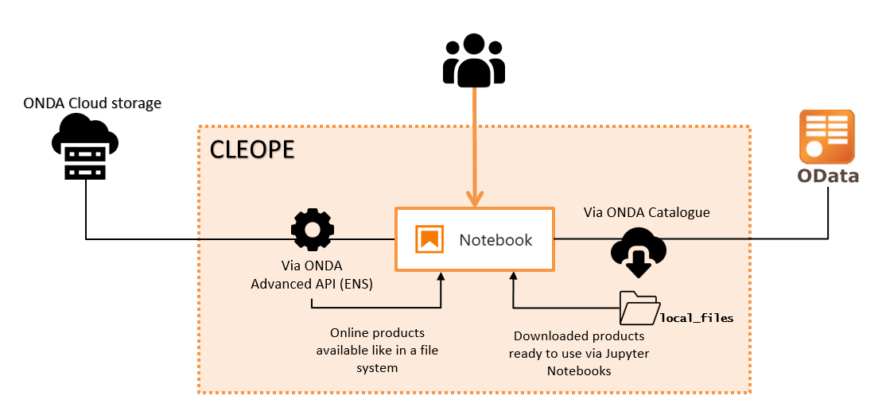

# Welcome to CLEOPE! 
**CLEOPE** (CLoud Earth Observation Processing Environment) is a DIAS-ONDA service of EO products discovery, manipulation and visualization via interactive Jupyter notebooks supported by Python 3 kernel language.

 

CLEOPE consists in a collection of pre-installed libraries and template notebooks to enhance users experience with ONDA data offer. All the examples are available in a shared environment with the aim to help users to easily explore ONDA services main functionalities, to learn how to access data and the way to approach EO cloud resources through Advanced API (ENS). 
Example notebooks are read and executable only. They are split into two main categories:
  - a set of templates aimed at facilitating the data access on Cloud;
  - a collection of mission specific tutorials, particularly suited for educational purposes, which will help users to process EO data offered by ONDA.

# The Workspace
CLEOPE **public workspace** offers collection of template notebooks aimed at easly introducing users to browse, inspect and download products via the OData API protocol or using DIAS-ONDA Advanced API (ENS). 

### OData API provided interface
Via their own Jupyter notebooks users can easily download ONDA products, by specifying their ONDA `username` and `password` and the desired item within the data offer. The download option is supported by the [OData API](https://www.onda-dias.eu/cms/knowledge-base/odata-odata-open-data-protocol/) protocol, an interface exposed by the Catalogue which allows browsing, selecting and downloading EO products in the Catalogue itself. Downloads are stored in the 📁 `local_files` folder within users own CLEOPE workspace, unzipped and ready to be used.

### Advanced API (ENS) provided interface
On the other hand the [Elastic Node Server (ENS)](https://www.onda-dias.eu/cms/knowledge-base/adapi-introduction/) software provides a simple and scalable front-end to the ONDA Data Storage on cloud which extends traditional Object Storages by exposing standard Directories and Files. Within CLEOPE a dedicated ENS access point exposing products in their native, unchanged format, is accessible to users that want to directly access products to process them (i.e. _legacy mode_). 

## Default directory tree

### Shared resources
📁`output` and 📁`resources` are folders sharing temporary data (i.e. logs) and sample inputs for the template notebooks set.  
📁`local_files` folder is the default destination folder of products downloaded via Jupyter Notebooks.  👉[Read more here.](Trials/readme.md)

#### Modules for generic ONDA data access
📠`modules` folder collects the main libraries related to the set of template notebooks aimed at guiding users to the data access. 

📄 `aoi.py`, `buttons.py` and `empty.py` are specific scripts interfaced with the geographical research of products via Jupyter Notebook;  
📄 `qm.py` is a module dedicated to the product **search**, **order** and **download** via Jupyter Notebooks. 

#### S2, S3, S5P, cams dedicated notebooks
📁🌎🌍🌏 Folders collecting mission specific notebooks, showing some type of processing for Sentinel missions and Copernicus Monitoring Services.  
The full explanation of mission specific trial notebooks is given 👉[here](Trials/readme.md). 

