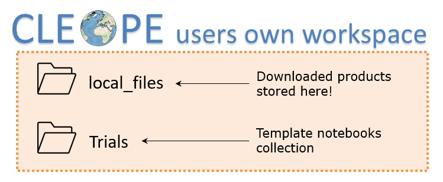
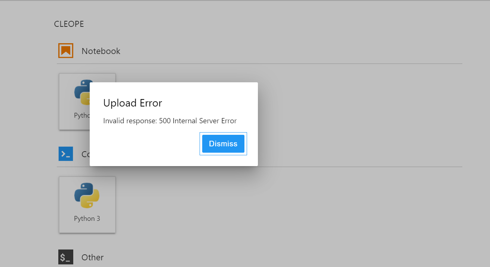

# Welcome to CLEOPE! 
**CLEOPE** (CLoud Earth Observation Processing Environment) is a DIAS-ONDA service of EO products discovery, manipulation and visualization via interactive Jupyter notebooks supported by Python 3 kernel language.

[](https://www.python.org/static/community_logos/python-logo.png) 


CLEOPE consists in a collection of pre-installed libraries and template notebooks to enhance users experience with ONDA data offer. All the examples are available in a shared environment with the aim to help users to easily explore ONDA services main functionalities, to learn how to access data and the way to approach EO cloud resources through Advanced API (ENS). 
Example notebooks provided into CLEOPE are split into two main categories:
  - a set of templates aimed at facilitating the data access on Cloud;
  - a collection of mission specific tutorials, particularly suited for educational purposes, which will help users to process EO data offered by ONDA.

More information on the Jupyter Notebooks application can be found  in the 👉 [official documentation](https://jupyter-notebook.readthedocs.io/en/stable/).<br>
Details on CLEOPE available resources provided 👉 [here](#tech).

# The Workspace
CLEOPE **public workspace** offers collection of template notebooks aimed at easly introducing users to browse, inspect and download Copernicus products via the OData API protocol and DIAS-ONDA Advanced API (ENS). 


### OData API provided interface
Via their own Jupyter notebooks users can easily download ONDA products, by specifying their ONDA `username` and `password` and the desired items. The download option is supported by the [OData API](https://www.onda-dias.eu/cms/knowledge-base/odata-odata-open-data-protocol/) protocol which allows browsing the ONDA Catalogue and then selecting and downloading EO products. All the downloaded products are stored in the 📁`local_files` folder accessible within user own CLEOPE workspace, unzipped and ready to be used.

### Advanced API (ENS) provided interface
On the other hand the [Elastic Node Server (ENS)](https://www.onda-dias.eu/cms/knowledge-base/adapi-introduction/) software provides a front-end to the ONDA Data Storage  which extends traditional Object Storages API by exposing standard Directories and Files. Within CLEOPE a dedicated ENS access point exposing products in their native format is provided to users that want to directly access products and process them. Check out [here](#pseudopaths) how to access products via ENS.

## Default directory tree



### Shared resources
`Trials` folder collects CLEOPE notebooks set, while the `local_files` folder is the default destination folder of products downloaded via Jupyter Notebooks. <br>

📁 `Trials/modules` folder collects the main libraries related to the set of template notebooks provided within CLEOPE workspace.
- Modules aimed at the **data access** are:
    - `aoi.py`, `buttons.py` and `empty.py`, which are specific scripts interfaced with the geographical research of products via Jupyter Notebook;
    - `qm.py` which is a module dedicated to the product **search**, **order** and **download** via Jupyter Notebooks. <br>
    
- Modules dedicated to **EO data processing** are scripts called in the mission dedicated notebook.
    - `cams.py`, `cgls.py` and `cmems.py` are named after the mission they are dedicated to - Copernicus Atmosphere, Copernicus Land and Copernicus Marine, respectively;
    - `data_processing_*.py` are named after the Sentinel mission of reference.<br>

Users can call the Python built-in methods to show help on CLEOPE functions, via:
- `help(<module-name>)` to display all the functions collected into each module;
- `<module-name>.<function-name>.__doc__` to display help on one single function of the module.

📁 All the other folders into the `Trials` main directory collect the trial notebooks set. More information on CLEOPE notebooks is provided 👉[here](Trials/readme.md).

# CLEOPE technical information
<a id="tech"></a>
CLEOPE is deployed as [The Littlest Jupyter Hub - TLJH](http://tljh.jupyter.org/en/latest/index.html) on OVH private cloud infrastructure provided with [ENS-legacy](https://www.onda-dias.eu/cms/knowledge-base/adapi-introduction/) interface, which allows users to directly access and process ONDA EO products.<br>
TLJH is configured with a **Python 3 kernel**, already provided with a set of additional Python packages aimed at EO data processing and visualisation with respect to any other default Jupyter environment.<br> Users can install any other Python package in their own CLEOPE environment via the `pip` channel in the way described 👉[here](#packages).

## Resource limitations
Registered users' hardware features are limited according to the subscription plan. Quotas are configured on DISK space, RAM and CPU number.

- **Disk limit** - when the threshold is exceeded an error message is printed out on screen, by both
    - command line:<br>`cp:error writing 'file': Disk quota exceeded`
    - GUI: <br>

- **RAM limit** - If users use more than the allowed amount of RAM, their notebook kernel will restart and a pop-up message is displayed:
<br> <br>
No other actions are allowed on the notebook in this case. Please note that shutdown unused notebooks is supplemental to helping with memory errors.

- **CPU limit** specifies the total CPU cores that each user can use within CLEOPE workspace. If the CPU limit is exceeded, computations may become very slow.

### Available Resources on CLEOPE *Free* account

| **Disk** |**RAM**|**CPU**|
| ------------- | ------ |-------------|
|20 GB|2 GB|2|

Please note that CLEOPE free account has a limited amount of resources available, thus some notebooks potentialities may be prevented. 👉 Upgrade to *Premium* and break out computational resources limitation for a better programming experience!

### Available Resources under *Premium* subscription 

CLEOPE service can be upgraded to _Premium_ subscription according to our commercial offer (REFERENCE). The increase of the available computational resources will enhance users' programming experience.

| **Disk** |**RAM**|**CPU**|
| ------------- | ------ |-------------|
|50 GB|7 GB|2|

💰 **Monthly subscription from € 29,00  ex. VAT.**

## Python 3 packages
### Installation
<a id="packages"></a>
#### Using Python pip
Opening a new terminal, users can call 
```shell
pip list
```
shell command to list all the installed packages and corresponding versions. Or also
```shell
pip show <package_name>
```
to show details on a single installed package.<br>
New packages can be easily installed running:
```shell
pip install <package_name>
```
or specifying the version:
```shell
pip install <package_name>==<version>
```
#### Using conda
Opening a new terminal, users can call 
```shell
conda list
```
shell command to list all the installed packages and corresponding versions. 
New packages can be easily installed running:
```shell
conda install –c conda-forge <package_name>
```
or specifying the version:
```shell
conda install –c conda-forge <package_name>=<version>
```
Please refer always the Python official documentation for each package to install.

### Add modules to the local path
By default, Python looks for its modules and packages in its absolute `PATH`. Within a python script, users can add path(s) occasionally to the default path by adding the following lines in the head section of the python application or script:
```python
import sys
sys.path.append('/home/jupyter-user/directory')
```
## ENS path to products
<a id="pseudopaths"></a>
Within CLEOPE environment, EO cloud resources can be easily accessed via the Advanced API (ENS).<br> Products are spread into hierarchical directories given the CLEOPE mounting point:
````shell
/mnt/Copernicus
````
Remote location of products can therefore be composed as follows:

|Mounting Point|Pseudopath|Product name|
| -------------|-------------|-------------|
`/mnt/Copernicus`|`What/When`|`filename.ext`

where the product name extension _.ext_ will depend on the product main class. We strongly recommand to read the [ONDA official documentation](https://www.onda-dias.eu/cms/knowledge-base/adapi-path-to-products/) about ENS path to products.
